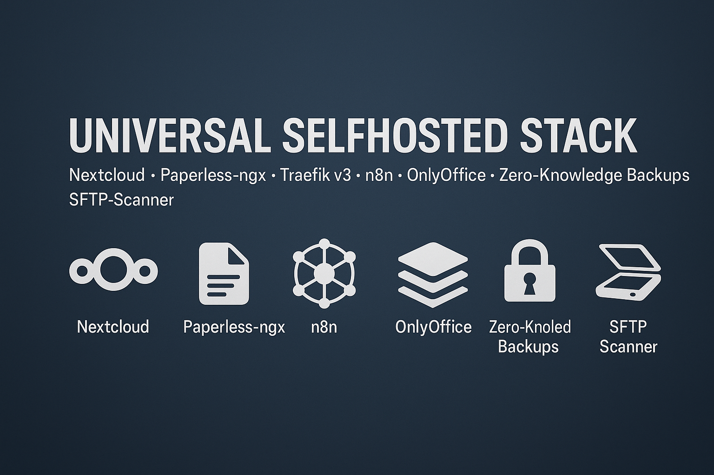

  
  
  
  

---

  

## 💖 Support This Project

If you'd like to support the development of this stack, you can use one of the options below:

&nbsp;

&nbsp;

Thank you for your support! ❤️

# Digital Company Cloud Stack

Ein vollständig automatisierter Selfhosted-Stack für Homelabs und Server.
Reverse Proxy, SSL, Cloud, Dokumentenmanagement, Office, Workflows, OCR, PDF Rendering, Backups und Zero-Knowledge Verschlüsselung – alles über ein einziges Setup-Skript.

A fully automated self-hosting environment for servers and homelabs.
Reverse proxy, HTTPS, cloud storage, document management, workflow automation,
OCR, PDF rendering, SFTP ingestion and encrypted backups – all deployed using a single setup script.

---

# DEUTSCH

## Überblick

Dieser Stack installiert automatisch:

- Traefik v3 (HTTPS, Reverse Proxy, Dashboard, ACME)
- Nextcloud 31
- Paperless-ngx mit Redis, Tika und Gotenberg
- OnlyOffice DocumentServer
- n8n Workflow Automation
- SFTP Scanner für Paperless Uploads
- Zero-Knowledge Backups via rclone crypt
- Optional Synology Backup

Alle Passwörter, Konfigurationen und Zertifikate werden automatisch erzeugt.

## Installation

Befehle zum Starten der Installation:

<pre><code>
wget https://raw.githubusercontent.com/m0usm/universal-selfhosted-stack/main/setup.sh -O setup.sh
chmod +x setup.sh
sudo ./setup.sh
</code></pre>

Das Setup fragt:

- Domain/Subdomains
- Let’s Encrypt E-Mail
- Paperless DB (PostgreSQL oder SQLite)
- Hetzner StorageBox Zugangsdaten
- Optional: Synology SFTP Backup
- Snapshot-Konfiguration
- Traefik BasicAuth für Dashboard

## Zugangsdaten

Automatisch generiert:

- Traefik Dashboard (BasicAuth)
- Nextcloud Administrator
- Paperless Administrator
- n8n BasicAuth + Encryption Key
- Datenbank Zugangsdaten
- Storage Box Zugangsdaten
- rclone crypt Encryption Key
- SFTP Scanner Login

Gespeichert in:

/opt/stack/.env

## Backup-System

Automatisch erzeugt:

- latest/ = vollständiger aktueller Stand
- archive/YYYY-MM-DD/ = tägliche Deltas
- snapshots/YYYY-MM-DD/ = Vollsnapshots

Manuelles Backup:
./maintenance.sh backup
Snapshots anzeigen:
./maintenance.sh snapshots
Wiederherstellen:
./maintenance.sh restore YYYY-MM-DD

## Projektstruktur

<pre><code>
/opt/stack/
├── setup.sh
├── docker-compose.yml
├── maintenance.sh
├── .env
├── data/
│   ├── traefik/
│   ├── nextcloud/
│   ├── paperless/
│   ├── n8n/
│   └── sftp/
└── backup/
    ├── Dockerfile
    ├── entrypoint.sh
    └── .dockerignore
  </code></pre>

## maintenance.sh Befehle

./maintenance.sh backup  
./maintenance.sh snapshots  
./maintenance.sh restore YYYY-MM-DD  
./maintenance.sh start  
./maintenance.sh stop  

## Sicherheit

- Bcrypt BasicAuth für Traefik
- Alle Backups vollständig verschlüsselt (rclone crypt)
- Sicherer Zugriff (chmod 600) auf .env und acme.json
- Keine Container ohne Reverse Proxy erreichbar

## Lizenz
MIT-Lizenz  

---

# ENGLISH

## Overview

This stack automatically deploys:

- Traefik v3 (HTTPS, reverse proxy, dashboard, ACME)
- Nextcloud 31
- Paperless-ngx with Redis, Tika and Gotenberg
- OnlyOffice DocumentServer
- n8n automation workflows
- SFTP scanner for Paperless ingestion
- Zero-knowledge encrypted backups using rclone crypt
- Optional Synology SFTP backup

All credentials, certificates and environment variables are generated automatically.

## Installation

Install using:

<pre><code>
wget https://raw.githubusercontent.com/m0usm/universal-selfhosted-stack/main/setup.sh -O setup.sh
chmod +x setup.sh
sudo ./setup.sh
</code></pre>

The installer will ask for:

- Domain and subdomains
- Let’s Encrypt email
- Paperless database selection
- Hetzner Storage Box credentials
- Optional Synology backup target
- Snapshot schedule
- BasicAuth for Traefik dashboard

## Credentials

Generated automatically:

- Traefik dashboard BasicAuth
- Nextcloud admin user
- Paperless admin user
- n8n BasicAuth + encryption key
- Database credentials
- Storage Box login
- rclone crypt encryption key
- SFTP scanner credentials

Stored in:

/opt/stack/.env

## Backup System

Automatic backup structure:

- latest/ = full current state  
- archive/YYYY-MM-DD/ = daily deltas  
- snapshots/YYYY-MM-DD/ = complete snapshots  

Manual backup:

./maintenance.sh backup
List snapshots:
./maintenance.sh snapshots
Restore example:
./maintenance.sh restore 2025-01-15

## Project Structure

<pre><code>
/opt/stack/
├── setup.sh
├── docker-compose.yml
├── maintenance.sh
├── .env
├── data/
│   ├── traefik/
│   ├── nextcloud/
│   ├── paperless/
│   ├── n8n/
│   └── sftp/
└── backup/
    ├── Dockerfile
    ├── entrypoint.sh
    └── .dockerignore
  </code></pre>
  
## maintenance.sh commands

./maintenance.sh backup  
./maintenance.sh snapshots  
./maintenance.sh restore YYYY-MM-DD  
./maintenance.sh start  
./maintenance.sh stop  

## Security

- Traefik dashboard protected via bcrypt BasicAuth
- All backups encrypted with rclone crypt
- Sensitive files restricted with chmod 600
- No exposed services without reverse proxy

## License
MIT License
